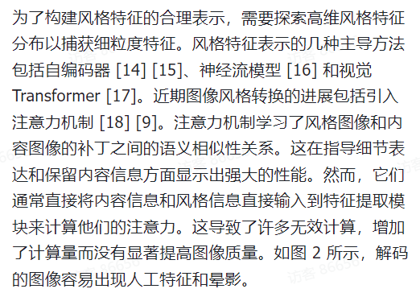
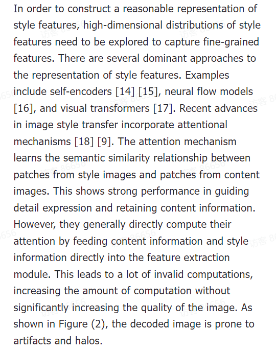
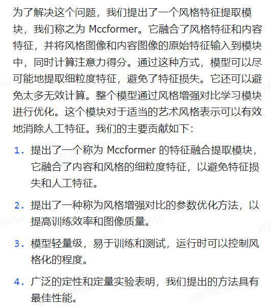
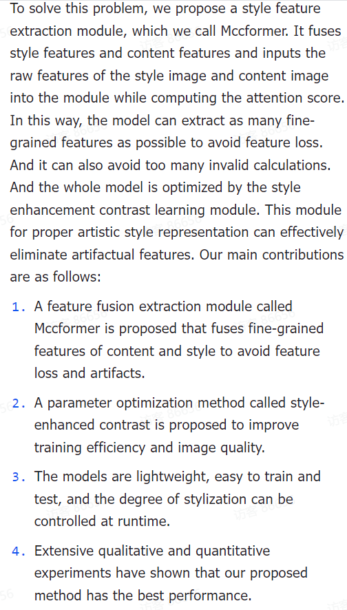
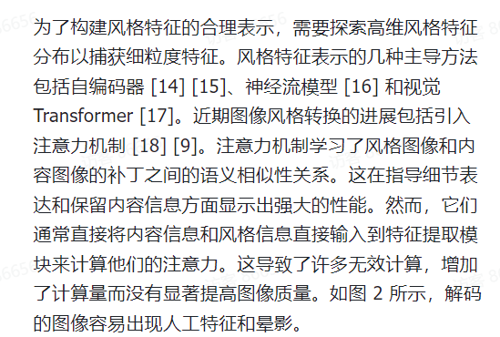
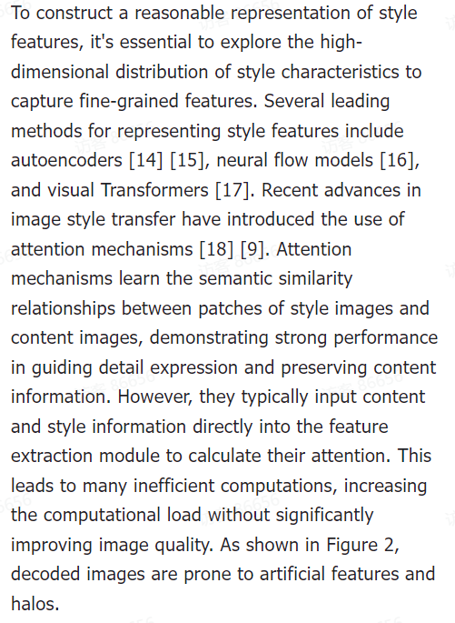
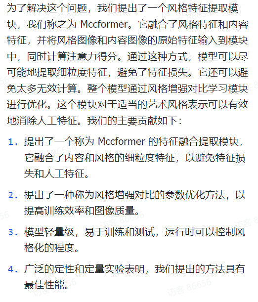
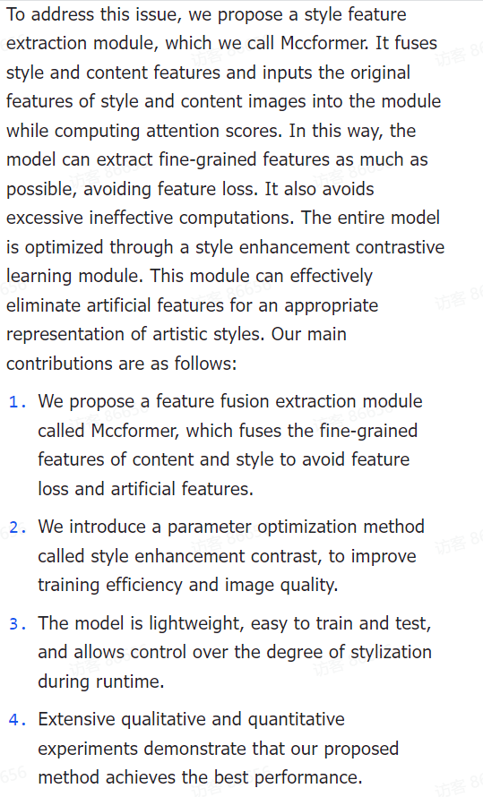

# GPT-Copilot开发文档（MarkDown版本）

开发环境:

后端Server:基于python flask框架

前端Web:基于js vue框架

### 一、3.15-3.28开发计划

###### 1.1 前端开发

###### 1.1.1登陆界面开发

配套后端开发已经基本完成

**notion**:验证码发送服务需要申请大厂服务(华为、阿里)，开发阶段采用的是UniSMS网站提供的服务，轻量级，后续产品正式上线后可以选择合适的服务商

###### 1.1.2 论文阅读界面开发

###### 1.1.3 AI论文导师界面开发

### 二、发布后会开发计划(完成P0开发)

##### 2.1 中英文互译

中译英 case1:

中译英 case2:

英译中 case1:

英译中 case2:

##### 2.2 论文润色改写

[Docs (feishu.cn)](https://bn4wfbzrio.feishu.cn/docx/JOjVdqAsJoaHdjxLj2ScHGUen6d)

##### 2.3 前后端重构

预计2-3周时间

### 三、发布后会开发计划(完成P1开发)

##### 3.1 论文阅读与查找

以开发在线文件系统为主,完善前端用户开发体验

##### 3.2 AI论文导师

###### 3.2.1 AI论文专业润色

以后端开发为主,相比于P0阶段的论文润色改写提供更好更专业的服务,涉及大模型prompt工程

###### 3.2.2 论文摘要标题生成

后端开发为主，涉及较为复杂的大模型prompt工程

###### 3.2.3 AI模拟rebuttal以及模拟审稿

后端开发为主，涉及复杂的大模型prompt工程

